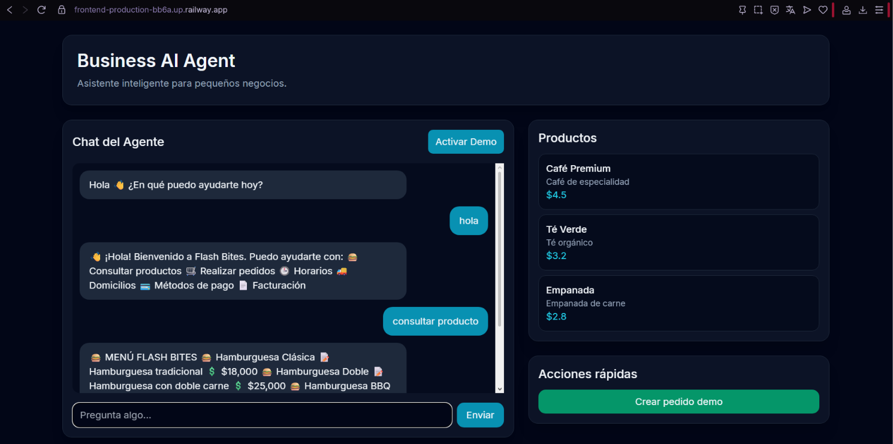

# Flash-Bites - Business AI Agent

Flash-Bites es una aplicación modular para asistir pequeños negocios mediante un agente inteligente. Permite gestionar productos, clientes, pedidos, facturación simulada y comunicación mediante un chatbot con capacidades de IA/RAG.

## Arquitectura

- **Frontend:** React + Vite + Tailwind CSS
- **Backend:** FastAPI + Python
- **IA/RAG:** LangChain + ChromaDB + documentos PDF/CSV
- **Base de datos:** SQLite actualmente (preparado para migración a PostgreSQL)
- **Contenedores:** Docker
- **Despliegue:** Railway + Docker

## Aplicación en producción

Frontend:

```bash
https://frontend-production-bb6a.up.railway.app
```

Backend API:

```env
https://flash-bites-production.up.railway.app
```

Documentación Swagger:

```env
https://flash-bites-production.up.railway.app/docs
```

---

## Requisitos de desarrollo

- Python 3.11+
- Node.js 20+
- Docker (opcional)

---

## Instalación Backend

Entrar al backend:

```bash
cd backend
```

Crear entorno virtual:

```bash
python -m venv .venv
```

Activar entorno virtual:

Windows:

```bash
.venv\Scripts\activate
```

Linux/Mac:

```bash
source .venv/bin/activate
```

Instalar dependencias:

```bash
pip install -r requirements.txt
```

Configurar variables:

Windows:

```bash
copy .env.example .env
```

Linux/Mac:

```bash
cp .env.example .env
```

Ejecutar servidor:

```bash
uvicorn app.main:app --reload
```

API disponible en:

```env
http://localhost:8000
```

Documentación:

```env
http://localhost:8000/docs
```

---

## Instalación Frontend

Entrar al frontend:

```bash
cd frontend
```

Instalar dependencias:

```bash
npm install
```

Crear archivo de variables:

```env
.env
```

Agregar:

```env
VITE_API_URL=http://localhost:8000/api/v1
```

Ejecutar:

```bash
npm run dev
```

Frontend disponible en:

```env
http://localhost:5173
```

---

## Variables de entorno

## Backend

Ejemplo:

```env
DATABASE_URL=sqlite:///./app.db
SECRET_KEY=secret-key
OPENAI_API_KEY=
```

## Frontend

```env
VITE_API_URL=https://flash-bites-production.up.railway.app/api/v1
```

---

## Pruebas

Backend:

```bash
cd backend
pytest
```

Frontend:

```bash
cd frontend
npm run build
```

---

## Despliegue en Railway

El proyecto está preparado para desplegarse mediante Docker en Railway.

### "Backend"

Configuración:

- Dockerfile:

```env
/Dockerfile
```

Puerto:

```env
8000
```

Comando:

```bash
uvicorn app.main:app --host 0.0.0.0 --port 8000
```

```bash
 Frontend bash
```

Configuración:

- Dockerfile:

```env
/frontend/Dockerfile
```

Variables:

```env
VITE_API_URL=https://flash-bites-production.up.railway.app/api/v1
```

El frontend genera una compilación Vite y se sirve mediante Nginx.

---

## Endpoints principales

## Salud

```bash
GET /health
```

## Autenticación

```env
POST /api/v1/auth/register
```

## Productos

```env
GET /api/v1/products
```

## Clientes

```env
POST /api/v1/customers
```

## Pedidos

```env
POST /api/v1/orders
```

```env
GET /api/v1/orders
```

## Facturación

```env
GET /api/v1/billing/invoice/{order_id}
```

## Chat IA

```env
POST /api/v1/chat
```

---

## Estado actual del proyecto

✅ Frontend desplegado en Railway  
✅ Backend desplegado en Railway  
✅ Comunicación React → FastAPI funcionando  
✅ API documentada con Swagger  
✅ Arquitectura preparada para crecimiento  

---

## Próximas mejoras

- Migración de SQLite a PostgreSQL
- Autenticación avanzada con roles
- Integración con WhatsApp Business API
- Facturación electrónica
- Persistencia avanzada para documentos RAG
- Monitoreo y métricas de producción

---

## Deployment

Aplicación desplegada correctamente en Railway:



## Licencia

Proyecto desarrollado como solución modular para automatización inteligente de pequeños negocios.
